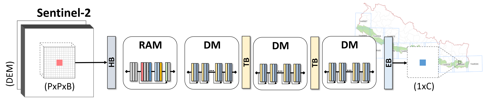

# Attentional Dense Convolutional Neural Network for Water Body Extraction From Sentinel-2 Images

[Janak Parajuli](https://scholar.google.com/citations?user=LE4-Gd8AAAAJ&hl=en), [Ruben Fernandez-Beltran](https://scholar.google.es/citations?user=pdzJmcQAAAAJ&hl=es), [Jian Kang](https://github.com/jiankang1991), [Filiberto Pla](https://scholar.google.es/citations?user=mSSPcAMAAAAJ&hl=es)
---

This repo contains the codes for the JSTARS paper: [Attentional Dense Convolutional Neural Network for Water Body Extraction From Sentinel-2 Images](https://ieeexplore.ieee.org/document/9855876). Monitoring water bodies from remote sensing data is certainly an essential task to supervise the actual conditions of the available water resources for environment conservation, sustainable development and many other applications. Being Sentinel-2 images some of the most attractive data, existing traditional index-based and deep learning-based water extraction methods still have important limitations to effectively deal with large heterogeneous areas since many types of water bodies with different spatial-spectral complexities are logically expected. Note that, in this scenario, optimal feature abstraction and neighbourhood information may certainly vary from water to water pixel, however existing methods are generally constrained by a fix abstraction level and amount of land cover context. To address these issues, this paper presents a new attentional dense convolutional neural network (AD-CNN) specially designed for water body extraction from Sentinel-2 imagery. On the one hand, AD-CNN exploits dense connections to allow uncovering deeper features while simultaneously characterizing multiple data complexities. On the other hand, the proposed model also implements a new residual attention module to dynamically put the focus on the most relevant spatial-spectral features for classifying water pixels. To test the performance of AD-CNN, a new water database of Nepal (WaterPAL) is also built. The conducted experiments reveal the competitive performance of the proposed architecture with respect to several traditional index-based and state-of-the-art deep learning-based water extraction models.





## Usage

./codes/model_ADCNN.py is the proposed model.


## Citation

```
@article{parajuli2022attentional,
  title={Attentional Dense Convolutional Neural Network for Water Body Extraction From Sentinel-2 Images},
  author={Parajuli, Janak and Fernandez-Beltran, Ruben and Kang, Jian and Pla, Filiberto},
  journal={IEEE Journal of Selected Topics in Applied Earth Observations and Remote Sensing},
  volume={},
  pages={--},
  year={2022},
  publisher={IEEE},
  doi={10.1109/JSTARS.2022.3198497}
}
```


## References

[1] Rezaee, M., Mahdianpari, M., Zhang, Y., & Salehi, B. (2018). Deep convolutional neural network for complex wetland classification using optical remote sensing imagery. IEEE Journal of Selected Topics in Applied Earth Observations and Remote Sensing, 11(9), 3030-3039.

[2] Huang, G., Liu, Z., Pleiss, G., Van Der Maaten, L., & Weinberger, K. (2019). Convolutional networks with dense connectivity. IEEE transactions on pattern analysis and machine intelligence.

[3] Wang, F., Jiang, M., Qian, C., Yang, S., Li, C., Zhang, H., ... & Tang, X. (2017). Residual attention network for image classification. In Proceedings of the IEEE conference on computer vision and pattern recognition (pp. 3156-3164).
